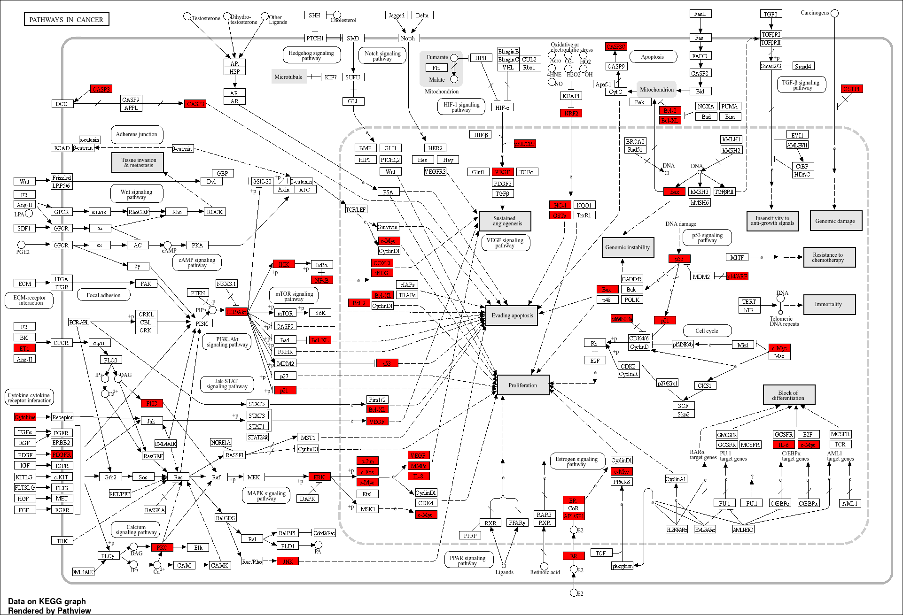

# 🌿 Network Pharmacology and Molecular Docking Insights into the Therapeutic Potential of Ginkgo Semen for Skin Cancer Treatment

## 📖 Project Overview
This undergraduate research project investigates the therapeutic potential of *Ginkgo semen* against skin cancer using computational biology and bioinformatics approaches.
The study combines network pharmacology, pathway enrichment analysis, molecular docking, and protein interaction analysis to identify important genes, pathways, and protein-ligand interactions that may contribute to anti-cancer activity.

## 🎯 Objectives
- Identify bioactive compounds present in Ginkgo semen
- Predict potential therapeutic targets
- Construct protein interaction networks
- Perform pathway enrichment analysis
- Identify significant miRNAs
- Validate protein-ligand interactions through molecular docking

- ## 🔬 Research Workflow
PubChem
⬇

GeneCards
⬇

STRING
⬇

DAVID
⬇

KEGG
⬇

Cytoscape
⬇

Discovery Studio
⬇

AutoDock
⬇

PyMOL

## 🛠️ Tools & Databases
| Category | Tool |
|-----------|------|
| Compound Information | PubChem |
| Target Prediction | GeneCards |
| Protein Database | UniProt |
| Protein Interaction | STRING |
| Network Visualization | Cytoscape |
| Functional Analysis | DAVID |
| Pathway Analysis | KEGG |
| Molecular Docking | Discovery Studio |
| Docking Validation | AutoDock |
| Visualization | PyMOL |

## 🧬 KEGG Pathway Analysis
KEGG enrichment analysis identified several cancer-related pathways associated with the predicted target genes.

## 🧬 miRNA–Gene Interaction Network
The miRNA network highlights important regulatory relationships between significant genes and their associated microRNAs.

## 🧪 Molecular Docking
The docking analysis demonstrates the interaction of Ginkgo semen compounds with important protein targets.

## 📂 Repository Structure
📁 fyp-ginkgo-skin-cancer
│
├── README.md
├── Final_Research_Report.pdf
├── molecular_docking.png
├── mirna_network.png
└── kegg_network.png

## 🚀 Future Improvements
- Include molecular dynamics simulation
- Expand compound screening
- Add additional docking targets
- Perform in vitro validation

- ## 📚 Citation
BS Bioinformatics Final Year Project
COMSATS University Islamabad
Department of Biosciences
2024

## 📄 Full Thesis
The complete undergraduate research thesis is available in this repository.
📄 **Download:** [sabeen fyp.pdf](Final_Research_Report.pdf)
